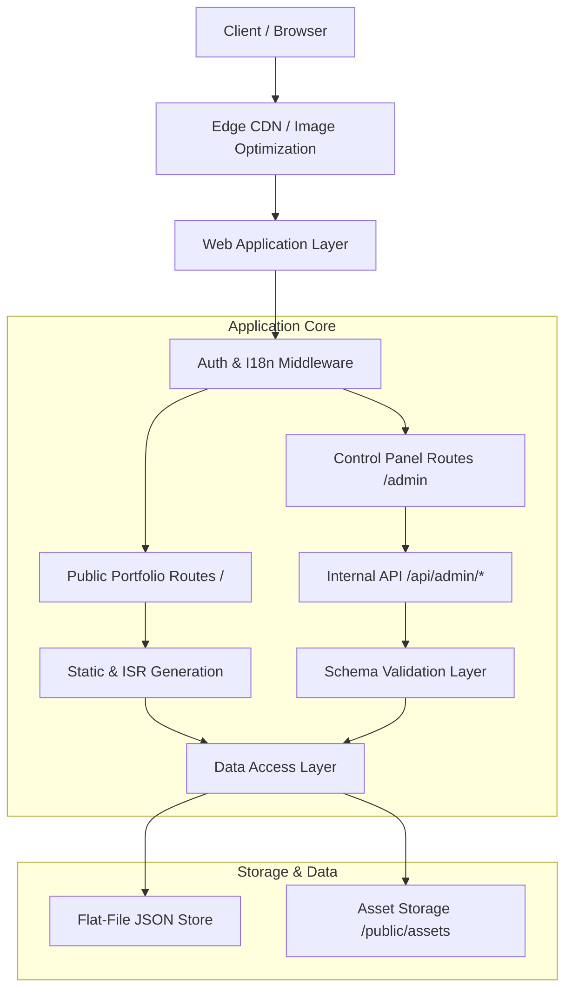

# Architecture & System Design

## 1. High-Level System Architecture

The Block Architecture Studio platform is transitioning to a modern, server-driven full-stack architecture (e.g., Next.js App Router). This approach allows us to deliver high-performance, statically generated (SSG) portfolio pages for clients while maintaining dynamic, authenticated server-rendered routes (SSR) for the internal Control Panel.

### Component Dependency Graph



## 2. Rendering Strategy

- **Public Portfolio (Showcase):** Heavily biased towards Static Site Generation (SSG) and Incremental Static Regeneration (ISR). This guarantees sub-second Largest Contentful Paint (LCP) and zero Cumulative Layout Shift (CLS). Pages are built at deploy time or revalidated on demand when JSON data changes.
- **Client Interactivity:** Client components (`"use client"`) are restricted to interactive leaf nodes such as image carousels, WebGL/3D spatial viewports, and language toggle state.
- **Control Panel:** Server-Side Rendered (SSR) with strict session validation. Bypasses the CDN cache to ensure studio members see real-time updates.

## 3. Directory Structure

A clean, modular scaffolding enforcing separation of concerns between presentation, business logic, data, and schema definitions.

```text
/
├── app/                      # Next.js App Router routes
│   ├── (public)/             # Portfolio routes (SSG/ISR)
│   ├── (admin)/              # Control panel routes (SSR, Authenticated)
│   └── api/                  # API endpoints for CRUD mutations
├── components/               # React Components
│   ├── ui/                   # Reusable, stateless structural UI (Buttons, Inputs, Cards)
│   ├── portfolio/            # Complex showcase components (InteractivePlans, HeroSlideshow)
│   └── admin/                # Control Panel specific views and forms
├── data/                     # The Flat-File JSON Database
│   ├── projects.json
│   ├── categories.json
│   └── settings.json
├── lib/                      # Core Utilities
│   ├── dal.ts                # Data Access Layer (Atomic reads/writes)
│   ├── auth.ts               # Session management and hashing
│   └── i18n.ts               # Bilingual (FA/EN) dictionary resolution
├── schemas/                  # Zod validation schemas
│   ├── project.schema.ts
│   └── settings.schema.ts
├── public/
│   └── assets/               # High-res photography, WebP/AVIF media, fonts
└── docs/                     # Architectural documentation
```

## 4. Frontend & Aesthetic Principles

- **Aesthetic Direction:** Spatial, clean, minimalist architectural aesthetic. High typographic discipline utilizing `YekanBakh` (FA) and `Helvetica Neue` (EN).
- **Layout Integrity:** Use of aspect-ratio wrappers and CSS Grid/Flexbox to ensure visual stability and prevent CLS.
- **Motion:** Restrict animations to CSS transitions and hardware-accelerated transforms (`transform`, `opacity`). Never block the main thread with heavy JS animations unless isolated within WebGL/Canvas nodes.
